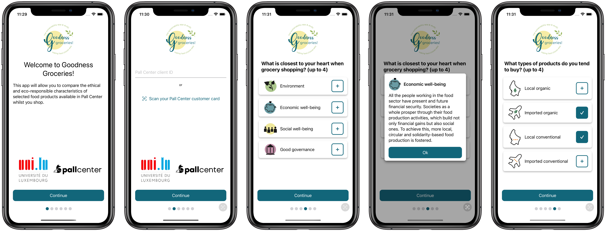

# Goodness Groceries
This repository contains my Bachelor Semester Project 3 & 4 at the University of Luxembourg which is an eco-friendly mobile application for iOS.
The app was built using the SwiftUI framework.

## Screenshots



## Requirements
* Xcode version >= 12.0.1
* iOS version >= 14.0

## Installation
Clone the repository to your computer:
```
git clone https://github.com/Flavio8699/Goodness-Groceries.git
```
Install [Rubustrings](https://github.com/dcordero/Rubustrings), which _checks the format and consistency of the Localizable.strings files of iOS Apps_:
```
sudo gem install rubustrings
```

## Build and simulate
1. Open the project file ***GoodnessGroceries.xcodeproj***
2. Once Xcode is open, wait until all the third-party libraries are fully downloaded and ready to run
3. Connect your ***iPhone*** with a USB cable to your computer or select the desired ***simulator*** on the top left corner
4. Tap the *Run* button (or <kbd>Command</kbd> + <kbd>R</kbd>) and wait until all the tasks are finished

## Distribute to AppStore with TestFlight (beta-testing)
1. Open the project file ***GoodnessGroceries.xcodeproj***
2. The build number **must** be incremented. _NB: the version number may remain untouched. Also note that the build and version number are not related_.
3. Goto menu : Product / Destination / Any iOS Device (arm64)
4. Build the project: goto menu "Project / Build". _NB: there are warnings, but there should not be any errors._
5. Archive the project: goto menu "Project / Archive".
6. Goto Window / Organizer.
7. Select the build to deploy to the App Store and click on the "Distribute App" button.
8. Then choose "App Store Connect", then "Upload", then click on "Next" with default options until "Upload" button.
9. Goto the app store connect website : https://appstoreconnect.apple.com/apps/1565971371/testflight/ios
10. You should see the new build appearing, maybe with a warning "Missing Compliance", if so, then click on the "Manage" link. Then choose Yes, then Yes. Then finally click on "Start Internal Testing".
11. Now that your new build is available for beta-testing. You may add some "Individual Testers", by clicking on the build number, then "Add Testers to Build".
12. Choose Add existing testers, and select all. Finally enter a text "Please test this new beta-version". 
13. You should wait for Apple to review this new build. This may take up-to 48 hours.

## Swift Packages used
* [SDWebImageSwiftUI](https://github.com/SDWebImage/SDWebImageSwiftUI): display images from URLs
* [CarBode](https://github.com/heart/CarBode-Barcode-Scanner-For-SwiftUI): barcode scanner for SwiftUI
* [Alamofire](https://github.com/Alamofire/Alamofire.git): HTTP networking library
* [SwiftyJSON](https://github.com/SwiftyJSON/SwiftyJSON.git): deal with JSON data in Swift
* [PermissionsSwiftUI](https://github.com/jevonmao/PermissionsSwiftUI): display and handle permissions in SwiftUI
* [Introspect](https://github.com/siteline/SwiftUI-Introspect): get the underlying UIKit or AppKit element of a SwiftUI view

## Contact
* [Benoît Ries](mailto:benoit.ries@uni.lu) (Tutor)
* [Flavio Matias](mailto:flavio8699@gmail.com) (Student)
